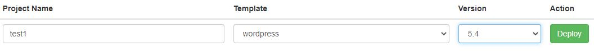
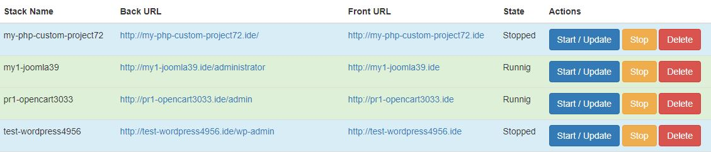
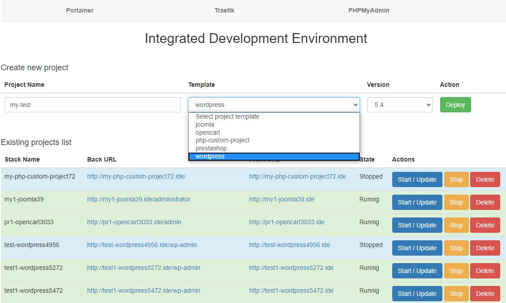

# Docker IDE with GUI for web development

Docker IDE with GUI saves time for setup web environment by development modules and themes for Joomla, Opencart, Prestashop, Wordpress and custom web-application as well.

At deploy is run automatically the docker-stack by selected template, and created project directory by path `./ide/projects/project_name/www/` *(this path is mounted into container as DocumentRoot)*, and database with *"stack_name"*.

## Features
* deploying of selected web-stack in 30 seconds
* ability Start/Restart/Stop/Remove of existing web-stacks from GUI
* ready deploy templates for custom PHP application with PHP 5.2 - 7.4
* ready deploy templates for Joomla 3.4 - 3.9
* ready deploy templates for Opencart 2.0.0.0 - 3.0.3.3
* ready deploy templates for Prestashop 1.6 - 1.7.x.x : latest
* ready deploy templates for Wordpress 3.9 - 5.4
* Traefik - a modern HTTP reverse proxy and load balancer that makes deploying microservices easy
* PHPMyAdmin - a web interface for MySQL and MariaDB
* Portainer - lightweight management UI which allows you to easily manage your different Docker environments
* Memcached server

## System requirements
* Linux
* Docker - version 17+
* Docker-compose - version 1.21+

## Usage
#### Initialization
* Clone repository `git clone https://github.com/oleh-v/ide.git`
* Run `./run.sh` script.
* !!! Add "env.*your_hostname*" (GUI) and "pma.*your_hostname*" (phpMyAdmin) to the **hosts** file.
* GUI will be available on the link http://env.*your_hostname*

#### Deploy new project

Fill project name, select template, version and press **Deploy** button.

This action deploys the docker stack, creates project directory by path `./ide/projects/project_name/www/` *(this path is mounted into container as DocumentRoot)* and database with `stack_name`. New MySQL database is automatically created as well and equals "Stack Name" column. User "root", Password empty

Project-website will be available on the link from `Back URL`/`Front URL` columns.

!!! You should to add each project domain to the **hosts** file. 

#### Manage existing projects

* **Start/Update button** start/update docker stack of existing project (`docker stack deploy ...`)
* **Stop button** removes docker stack (`docker stack rm ...`) But all data won't to be removed. This stack can be started later.
* **Delete button** removes docker stack and ALL DATA (database and project files). **Be careful!**

!!! Don't forget to add each project domain from `Front URL` to the **hosts** file.

For Linux: `/etc/hosts`

For Windows: `C:\Windows\System32\drivers\etc\hosts`

#### MySQL
To connect to the MySQL database from any project:
* host: `mysql`
* port: `3306`
* database: *stack_name*
* user: `root`
* Password: *empty*

#### Memcached
To connect to Memcached server from any project:
* host: `memcached`
* port: `11211`

#
Enjoy!

